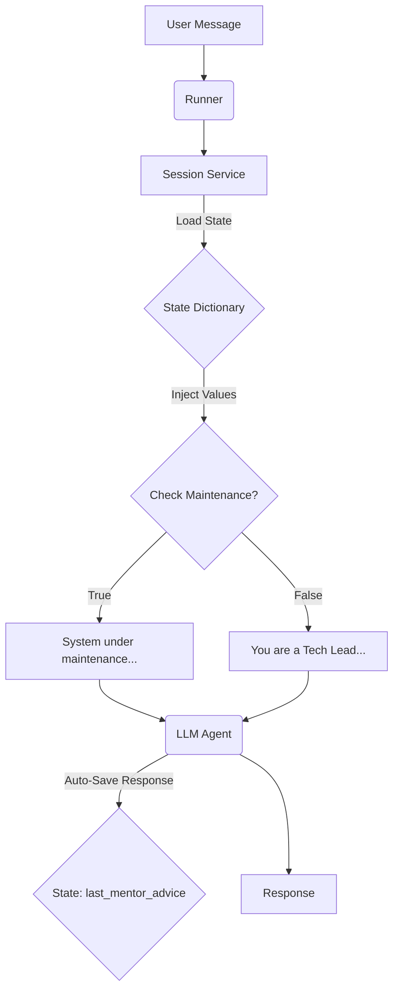

# Module: Dynamic Persona & Guardrails via State Injection

This project demonstrates the advanced capabilities of the **Google ADK framework**, specifically focusing on **Session State** management. It shows how to create an agent that is not only context-aware (changing behavior based on user role) but also capable of conditional logic (global guardrails like "Maintenance Mode").

## 🧠 Logic & Visualization

To understand how `dynamic_persona_provider` works, let's upgrade our **"Method Acting" Analogy**:

  * **Agent (The Actor):** Ready to perform, but relies entirely on the Director.
  * **State (The Script Notes):** Context variables describing the current scene.
      * `user:role`: The user's rank (e.g., "Junior Developer").
      * `current_topic`: The locked discussion topic (e.g., "Memory Management").
      * `app:maintenance_mode`: **(New)** A global flag (True/False) to pause the system.
  * **InstructionProvider (The Director):** Before every line is delivered, the Director checks the **Script Notes**:
    1.  **The Guardrail Check:** First, is the stage safe? If `maintenance_mode` is **ON**, the Director shouts *"Cut\! System Closed."* (Static Response).
    2.  **The Persona:** If the stage is safe, the Director gives motivation: *"You are a strict Tech Lead talking to a Junior..."* (Dynamic Persona).
  * **Output Key (The Review):** The final response is automatically logged back into the notes (`last_mentor_advice`).

### Data Flow Diagram



## 📂 Project Structure

The project is organized for scalability using Poetry and a Makefile for automation:

```text
.
├── Makefile             # Commands: install, test, lint, format, run, clean
├── poetry.lock          # Frozen dependencies
├── pyproject.toml       # Dependencies (google-adk >= 1.19.0)
├── README.md            # Documentation
├── src
│   ├── core
│   │   ├── agent.py     # MAIN LOGIC: Provider, Agent, Guardrails
│   │   ├── config.py    # Env vars & Model Config
│   │   ├── __init__.py
│   │   └── session_mngr.py # (Optional/Stub for session management)
│   └── __init__.py
└── tests                # Unit tests
    └── __init__.py
```

## ⚙️ Setup & Installation

1.  **Prerequisites**: Python 3.13+, Poetry installed.
2.  **Environment**:
    Use the `Makefile` to install dependencies and setup pre-commit hooks:
    ```bash
    make install
    ```
3.  **Configuration**:
    Create a `.env` file in the root directory:
    ```text
    GOOGLE_API_KEY=your_actual_api_key
    ```

## 🚀 Usage

The project includes a simulation in `src/core/agent.py`.
**Note:** The current configuration explicitly sets **`app:maintenance_mode` to `True`** in the `initial_state`. This demonstrates the "Guardrail" functionality.

Run the simulation:

```bash
make run
```

### Expected Output (Maintenance Mode)

Observe that the Agent **refuses** all prompts—even valid technical ones or casual jokes—because the State dictates the app is in maintenance.

```text
--- INITIALIZING SESSION: {'user:role': 'Junior Developer', 'current_topic': 'Memory Management', 'app:maintenance_mode': True} ---

USER: Hi, can you help me with Python?
MENTOR: System under maintenance. Try again later.

USER: Okay, tell me about Stack and Heap.
MENTOR: System under maintenance. Try again later.

USER: Tell me a some joke on Russian language.
MENTOR: System under maintenance. Try again later.

INFO:root:State 'last_mentor_advice': System under maintenance. Try again later....
```

> **Experiment:** To see the "Tech Lead" persona in action, change `app:maintenance_mode` to `False` in `src/core/agent.py`.

## 💻 Code Highlights

### 1\. The Guardrail Logic

We updated the provider to check for `maintenance_mode` *before* generating the persona. This prevents the LLM from processing instructions when the system should be closed.

```python
def dynamic_persona_provider(context: ReadonlyContext) -> str:
    # 1. READ State
    user_role = context.state.get("user:role", "Intern")
    current_topic = context.state.get("current_topic", "General Chat")
    app_maintenance_mode = context.state.get("app:maintenance_mode", False)

    # 2. CONDITIONAL CHECK (The Kill Switch)
    if app_maintenance_mode:
        return "System under maintenance. Try again later."

    # 3. GENERATE PERSONA (Only if Active)
    return (
        f"You are a strict Senior Tech Lead. "
        f"You are currently mentoring a user with the rank of '{user_role}'. "
        f"The current discussion topic is locked to: '{current_topic}'..."
    )
```

### 2\. State Initialization

The behavior is determined entirely by the dictionary passed at the start of the session.

```python
initial_state = {
    "user:role": "Junior Developer",
    "current_topic": "Memory Management",
    "app:maintenance_mode": True  # <--- Change this to False to enable the agent
}
```
