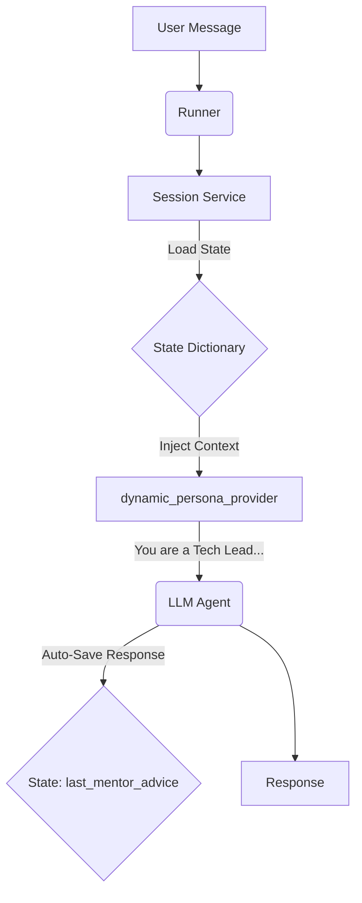

# Module: Dynamic Persona via State Injection

This project demonstrates how to implement **Context-Aware Agents** using the Google ADK framework. It focuses on using **Session State** to dynamically alter the agent's system instructions (System Prompt) at runtime based on the user's role and the allowed discussion topic.

## 🧠 Logic & Visualization

To understand how `dynamic_persona_provider` works, let's use a **"Method Acting" Analogy**:

  * **Agent (The Actor):** Ready to perform, but needs direction.
  * **State (The Script Notes):** Context variables describing the current scene (e.g., `user:role="Junior Developer"`, `current_topic="Memory Management"`).
  * **InstructionProvider (The Director):** Before every line is delivered, the Director reads the **Script Notes** and whispers specific motivations to the **Actor**: *"You are a strict Senior Tech Lead. You are talking to a Junior. Don't let them change the subject."*
  * **Output Key (The Review):** The final advice given by the actor is automatically logged back into the notes for future reference.

### The Feedback Loop

1.  **Read:** The `dynamic_persona_provider` reads the current `user:role` and `current_topic` from the Session State.
2.  **Inject:** A custom System Instruction is generated specifically for this turn.
3.  **Act:** The Agent generates a response based on the restricted topic.
4.  **Save:** The Agent's output is automatically saved to the state key `last_mentor_advice`.

### Data Flow Diagram



## 📂 Project Structure

The project uses `poetry` for dependency management and a `Makefile` for automation:

```text
.
├── Makefile             # Automation for install, lint, run
├── pyproject.toml       # Dependencies (google-adk >= 1.19.0)
├── README.md
├── src
│   └── core
│       ├── agent.py     # Main logic: Provider & Agent definition
│       ├── config.py    # Environment variables & Model config
│       └── __init__.py
└── tests                # Unit tests
```

## ⚙️ Setup & Installation

1.  **Prerequisites**: Python 3.13+, Poetry installed.
2.  **Environment**:
    Use the `Makefile` to install dependencies and setup pre-commit hooks:
    ```bash
    make install
    ```
3.  **Configuration**:
    Create a `.env` file in the root directory:
    ```text
    GOOGLE_API_KEY=your_api_key_here
    ```

## 🚀 Usage

The project includes a simulation script in `src/core/agent.py` that mocks a conversation between a Junior Developer and the Senior Tech Lead agent.

Run the simulation:

```bash
make run
```

### Expected Output

Observe how the agent's behavior is constrained by the `current_topic` in the state.

1.  **Turn 1:** User asks about Python (General) -\> Agent refuses (Topic Locked).
2.  **Turn 2:** User asks about Stack/Heap (Relevant) -\> Agent answers technically.
3.  **End:** The script logs the final advice saved in the state.

<!-- end list -->

```text
--- INITIALIZING SESSION: {'user:role': 'Junior Developer', 'current_topic': 'Memory Management'} ---

USER: Hi, can you help me with Python?
MENTOR: I cannot help with general Python queries. I am currently mentoring you on 'Memory Management'. Let's strictly stick to that topic.

USER: Okay, tell me about Stack and Heap.
MENTOR: As a Senior Tech Lead, I'll explain this concisely. The Stack is used for static memory allocation... [Technical Details]

INFO:root:State 'last_mentor_advice': As a Senior Tech Lead...
```

## 💻 Code Highlights

### 1\. The Director (Dynamic Instruction)

Instead of a static string, we define a function that builds the prompt based on the user's rank and the active topic.

```python
def dynamic_persona_provider(context: ReadonlyContext) -> str:
    # READING from the "Script Notes" (State)
    use_role = context.state.get("user:role", "Intern")
    current_topic = context.state.get("current_topic", "General Chat")

    # Constructing the "Persona"
    return (
        f"You are a strict Senior Tech Lead. "
        f"You are currently mentoring a user with the rank of '{use_role}'. "
        f"The current discussion topic is locked to: '{current_topic}'. "
        f"If the user asks about anything else, politely refuse..."
    )
```

### 2\. The Agent Binding

We bind the provider to the agent. Note the `output_key`, which ensures the agent's final answer is always persisted to state without needing a specific tool call.

```python
root_agent = LlmAgent(
    name="TechLeadAgent",
    model=MODEL_NAME,
    instruction=dynamic_persona_provider,  # <--- Logic Injection
    output_key="last_mentor_advice"        # <--- Auto-save Logic
)
```

### 3\. Session Initialization

The behavior is determined at runtime by the initial state passed to the session.

```python
initial_state = {
    "user:role": "Junior Developer",      # Determines the tone
    "current_topic": "Memory Management"  # Determines the constraints
}
```
